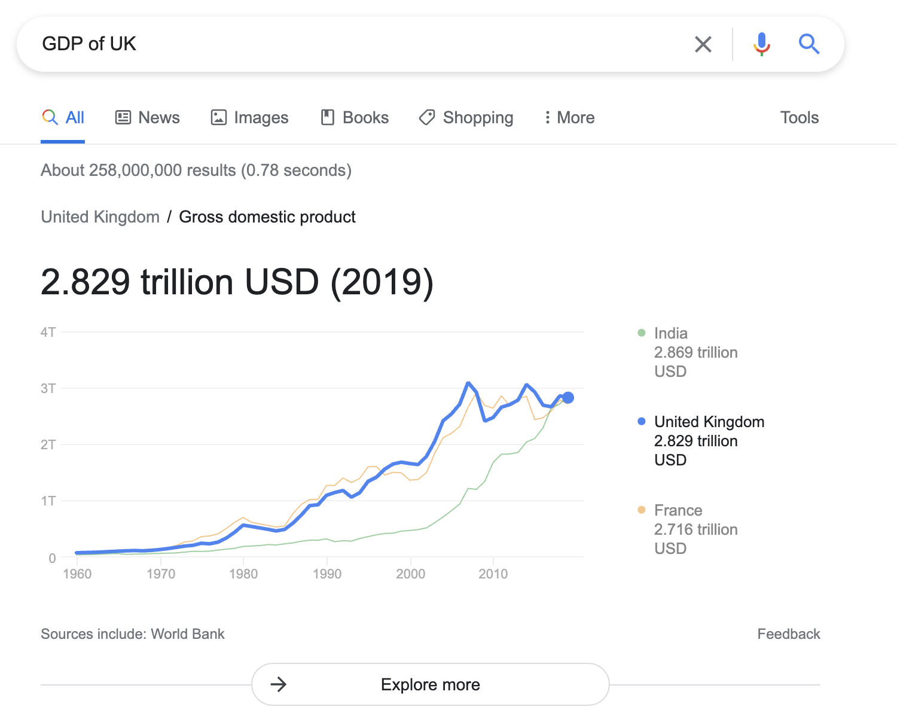

# Introduction

The UK government [publishes its statistics](https://www.gov.uk/search/research-and-statistics?content_store_document_type=statistics_published&order=updated-newest) openly, typically in presentational spreadsheets. While publishing statistics in spreadsheets _does_ succeed in getting important information into the public domain, we recognise there are still barriers and challenges to accessing and using the data we produce:

- A user must locate and navigate through many large spreadsheets to understand what data are available.
- Metadata are provided in an unstructured or unstandardised way.
- Analysts need to data wrangle because data are provided in unstandardised and presentational formats.
- Data are in silos, making it difficult to link or relate statistics from different sources.
- Accessibility, usability, and inclusion of statistics and data varies from dataset to dataset.

Because we can use a spreadsheet to represent the same underlying data in multiple ways, analysts have begun adopting [**tidy data**](https://r4ds.had.co.nz/tidy-data.html) as an unofficial standard for statistical data. We describe our use of tidy data in more detail in Section \@ref(tidy-data), but to summarise, tidy data is a set of data structures that are designed to make it easier to work with and share data.

With spreadsheets often carrying out multiple functions at the same time - _storing_, _describing_, _presenting_ and performing _calculations_ with data - packages such as [`unpivotr`](https://github.com/nacnudus/unpivotr) and [`databaker`](https://github.com/sensiblecodeio/databaker) now exist to extract the bare statistical data into the tidy format, where it is conveniently shaped for further analysis.

Tidy data helps to make data more easily accessible and usable to analysts, but there is still a need for metadata - how do we know what data is available, what the meaning of the data is, and how to use it? Metadata provides important context, which is essential for making sense of data and for making decisions about how to use it. Some examples where metadata are required include: ^[@info10080249]

- Datasets have titles, descriptions, creators, sources, licences, and other metadata, all of which provide important context alongside the actual data itself.
- A `year` column could represent a calendar year or represent a different type of year - the UK's tax year spans from April to March, whereas an academic year begins in September.
- A `weight` column could represent a weight in kilos, but in a different dataset could represent a weight in pounds, or a categorisation of different weights such as `light` or `heavy`, making it difficult to relate the data.
- A column may contain codes such as `02` and `03` which need additional metadata to explain these stand for _"forestry and logging"_ or "_fishing and aquaculture"_.

We think these challenges can be solved by using **linked data**, an open data standard proposed by Sir Tim Berners-Lee, inventor of the World Wide Web ^[@bernerslee:2006].

## What is linked data?

Linked data is a way of publishing data that means information is interoperable, connected and more meaningful. By giving searchable and common identifiers to data items, it becomes possible to link data together and to find out more about the data.

Statistical releases in spreadsheets often include a cover sheet with metadata such as `titles`, `descriptions` and methodological information. A human is able to recognise this information, but the data are not structured in a way which a computer can understand.

The W3C share an analogy^[https://www.w3.org/wiki/SemanticWebCerealBox]:

> Let's say you're going to the grocery store. At the grocery store, you get a box of cereal, right? So, you go to the self-checkout, and shout to the computer, "I am buying a box of cereal!"
> 
> Of course, in this day and age, the computer doesn't understand you. It just says, "Please slide the item across the reader..."
> 
> So you find the bar code on the cereal. You slide it past the laser reader. Suddenly- bingo. The computer knows what the item is, how much it costs, how many you've bought so far, etc., etc., etc.,. Computers don't yet know how to just "look" at the item, and know what it is.
>
> [...] The SemanticWeb is like bar codes for the web.

Search engines encourage website owners to include structured data in their websites. By providing context about what the data on a website represents, Google is able to cater search results to better meet the needs of the user. ^[https://developers.google.com/search/docs/advanced/structured-data/intro-structured-data#search-appearance] If I search `GDP of UK` on Google I receive a chart showing how the GDP of the UK compares with the GDP of the UK with other, similar countries.

{width=100%}

By using linked data, the machine is able to understand the context of the statistics and display results in a way that is convenient to the user.

### Principles

In his design issue, @bernerslee:2006 set out four principles for linked data:

> 1. Use URIs as names for things.
> 2. Use HTTP URIs so that people can look up those names.
> 3. When someone looks up a URI, provide useful information, using the standards (RDF, SPARQL).
> 4. Include links to other URIs, so that they can discover more things.

We can describe these principles in more detail:

1. A URI (**Uniform Resource Identifier**) is a string of characters used to identify a resource, such as `https://www.google.com`, `urn:isbn:0-14-013629-0` or `spotify:track:4JEylZNW8SbO4zUyfVrpb7`. When creating linked data, we give data items which refer to _things_ URIs.

2. The URIs we assign should be should be **hypertext transfer protocol** (HTTP) URIs, beginning with `http://`. Entering a HTTP URI into a web browser would make the browser interpret the URI as a web address. The browser will then guide the user to more information about the resource. ^[When a URI explains how to access the resource they refer to (such as a HTTP URI), they are known as a **Uniform Resource Locator** (URL). All URLs are URIs, but not all URIs are URLs.]

3. A machine looking up a HTTP URI should be provided with data about the resource, expressed using the **Resource Description Framework** (RDF). ^[[RDF Primer](https://www.w3.org/TR/rdf-primer/)] An RDF statement is like a sentence about a resource, such as 
    - `<http://example.org/my-statistics> dcterms:title "Some Example Statistics"`, or
    - `<http://www.ross.com/me> foaf:knows <http://www.alex.com/me>`.
   
   RDF isn't a specific data format, but a standardised model for providing information about resources. We describe RDF in more detail [below](#about-rdf).

4. Using RDF we can define relationships between URIs, so that we can discover more information about the thing described by that URI. For example, we might link a book's URI to the URI for the book's author, or to the URI for the book's publisher.

### Linked _Open_ Data

> TODO: Explain the stars.

> - ⭐ Available on the web (whatever format) _but with an open licence, to be Open Data_
> - ⭐⭐ Available as machine-readable structured data (e.g. excel instead of an image scan of a table)
> - ⭐⭐⭐ as (2) plus non-proprietary format (e.g. CSV instead of excel)
> - ⭐⭐⭐⭐ All the above plus, Use open standards from W3C (RDF and SPARQL) to identify things, so that people can point at your stuff
> - ⭐⭐⭐⭐⭐ All the above, plus: Link your data to other people's data to provide context

Data can be linked, but to get a star, the data needs an open licence.

### About RDF

From the [RDF Primer](rdfprimer:2014):

> RDF allows us to make statements about resources. The format of these statements is simple. A statement always has the following structure: ```<subject> <predicate> <object>```. 
>
> An RDF statement expresses a relationship between two resources. The subject and the object represent the two resources being related; the predicate represents the nature of their relationship. The relationship is phrased in a directional way (from subject to object) and is called in RDF a property. Because RDF statements consist of three elements they are called triples.

As an example, `http://statistics.data.gov.uk/id/statistical-geography/W92000004` is the URI associated with the ONS Geography code for Wales. A machine looking up this URI will find:

```ttl
@prefix sgid: <http://statistics.data.gov.uk/id/statistical-geography/> .
@prefix sgdef: <http://statistics.data.gov.uk/def/statistical-geography/> .

# subject      # predicate        # object
sgid:W92000004 sgdef:officialName "Wales" .
```

This indicates the "official name" of the resource with URI `http://statistics.data.gov.uk/id/statistical-geography/W92000004` is "Wales" in the form of a triple:

- a **subject** `http://statistics.data.gov.uk/id/statistical-geography/W92000004`,
- a **predicate** `http://statistics.data.gov.uk/def/statistical-geography/officialName`,
- and an **object** `"Wales"`.

The format known as turtle (the Terse RDF Triple Language). The prefixes `sgid` and `sgdef` are a shorthand - when humans try to read RDF it can be difficult to decipher lines of long URIs. 

The RDF statement could be shown visually as:

```{r, echo=FALSE}
DiagrammeR::grViz("
    digraph G {
        graph [bgcolor = transparent, rankdir = LR];

        node [fontname = Helvetica]
        W92000004 [label = 'sgid:W92000004', shape = ellipse];
        Wales [label = 'Wales', shape = box];

        edge [fontname = Helvetica]
        W92000004 -> Wales [label = 'sgdef:officialName'];
    }
    ",
    height = 200
)
```

### An example

> TODO: https://cran.r-project.org/web/packages/rdflib/vignettes/rdf_intro.html
